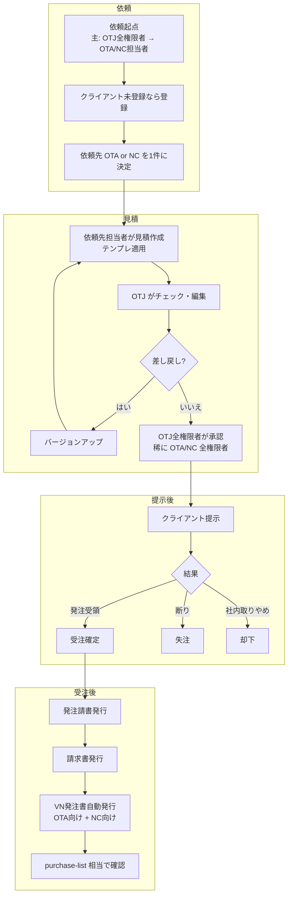
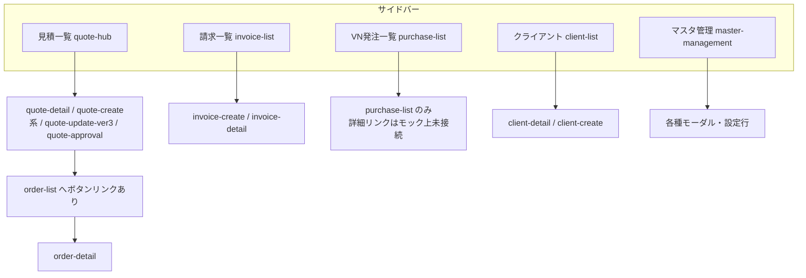
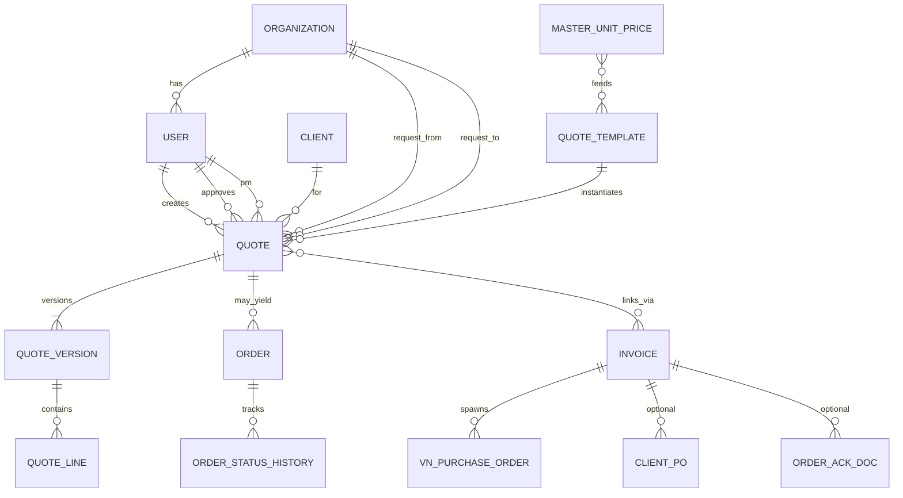
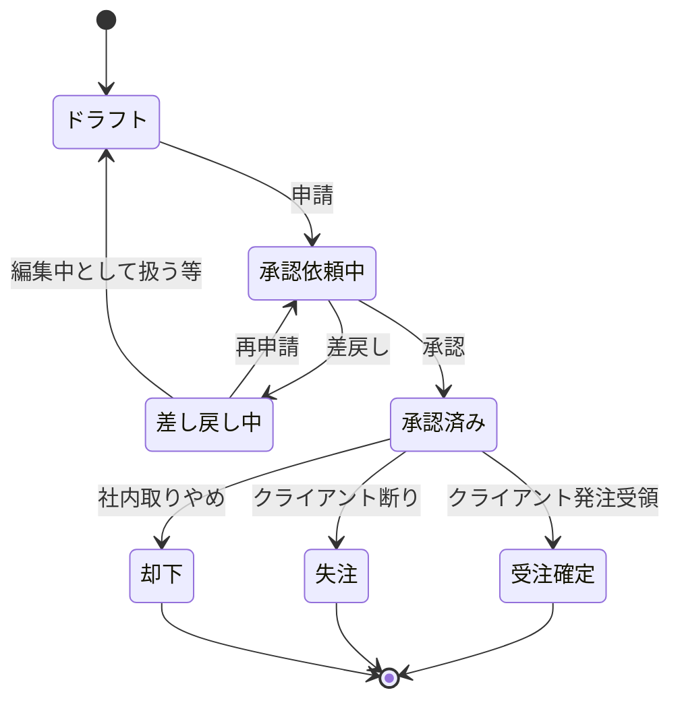
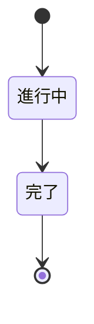

# 開発依頼書 — 社内業務管理システム

**一次資料:** 本リポジトリ内の静的モック（`pages/`・`js/`・`css/`。**`_archive/` は本書の根拠資料としない**）  
**想定読者:** 本業務ドメインを概ね理解している開発者。実装は **バイブコーディング** を想定する。  
**技術スタック:** 本書では **言語・フレームワーク・インフラを指定しない**（開発者判断）。  
**優先ルール:** **モックとオーナー確定の業務フロー・用語・データモデルが矛盾する場合は、オーナー確定事項を正とする。** モックは試作品である。

---

## 0. はじめに

オーナーレビューでは **次の 0.1 → 0.2** を先に確認すると、未確定論点と開発者協議事項を一望できる。

### 0.1 ※要確認項目サマリ（河本オーナーが次レビューで回答すべき論点）

| # | 論点 |
|---|------|
| 1 | **原価データ構造** — OTA原価 / NC原価 / 発注先原価 / OTJ原価の関係、計算式、承認画面に載せる指標の定義 |
| 2 | **ヘッダー「プロフィール」「設定」** の遷移先・権限 |
| 3 | **条文 textarea** の法務監修フロー（正本・差分管理・多言語時の扱い） |
| 4 | **削除権限** の所在（全権限者のみ／担当者条件付き 等） |
| 5 | **担当者の「自社」の定義** — 組織横断の閲覧可否（例: OTA 担当が NC 案件を一覧で見えるか） |
| 6 | **VN発注書の自動発行タイミング** — 請求書発行時のみか、受注確定時も発行するか |
| 7 | **認証方式**（SSO の有無、MFA、セッション方針） |
| 8 | **多言語対応**（日本語 UI 前提のまま OTA/NC のベトナム人メンバーが利用する際の要件） |
| 9 | **想定同時利用規模** |
|10 | **性能・セキュリティの最低ライン**（SLA、監査ログの保存先は CloudTrail 前提だがアプリ側要件） |
|11 | **見積ステータス（モック）と本番モデルの語彙対応** — 例: モック「新規」「承認待ち」等と、オーナー定義の「ドラフト」「承認依頼中」等の **1:1 マッピング** |
|12 | **概算見積の「チャット形式」** — モック上の UI 表現（テキストエリア・コメント欄等）の正確な仕様 |
|13 | **見積バージョンのスナップショット範囲** — 明細・条件文・PDF 相当のどこまでがバージョン単位で凍結されるか |

### 0.2 議論ポイントサマリ（開発者とオーナーで合意形成）

1. **マスタ管理の「見積詳細条件設定」（請負 / 保守 / ラボ）の必要性** — 運用削減の観点で不要化する可能性。
2. **マスタ管理の「準備中」ボタン**（現モックでは disabled）の **正式要件**（何を開くべきか、優先度）。

### 本書の目的

- 別開発者がモックを参照しつつ、**本番相当の社内業務管理システム**を実装するための要件の骨子を渡す。
- 画面の置き場・項目・遷移はモックから読み取り、**権限・ステータス・組織間フロー・ER** はオーナー確定事項で補完する。
- 推測で穴埋めせず、不明点は **※要確認** に集約する。

### 受け手の前提

- OTJ / OTA / NC の三社構造と、見積〜請求〜VN発注の大まかな流れを理解していること。
- 静的 HTML モックは **Chrome 等のブラウザで開けるデモ**であり、認証・API・永続化は未実装であることを理解していること。

### 開発手法

- バイブコーディング（対話しながら実装を進める）を想定。
- 本書は **受け入れ条件とデータの境界** に重点を置き、UI のピクセル単位やコンポーネント分割方針は記さない。

---

## 1. 目的・背景

### 1.1 解決する業務課題

- OTJ を中心に、**OTA / NC への依頼 → 見積作成 → 社内承認 → クライアント提示 → 受注/失注/却下** までを一連で追跡したい。
- 見積は **通常（見積書あり）** と **概算（依頼内完結・見積書なし）** が同居し、**同一ステータスモデル**で回す。
- 受注後は **発注請書・請求書** をシステムから出し、請求に紐づく **OTA/NC 向け VN発注書** を自動化したい（モックは一覧・請求までを重点表示）。

### 1.2 導入後のあるべき姿

- 三社の全権限者・担当者が、**権限に応じた範囲**で見積・受注・請求・VN発注状況を参照・操作できる。
- **依頼カテゴリー 7 種**で分岐し、テンプレート（請負/ラボ/保守）から初期値を生成しつつ、案件単位で上書き可能。
- 見積と請求は **M:N** と独立請求を許容し、請求番号は **`INV-YYYY-NNNN`** で統一（UI は「クライアント」、条文・帳票は「顧客」など用語ルール順守）。

### 1.3 関係組織の位置づけ

| 組織 | 略称 | 役割（オーナー確定） |
|------|------|----------------------|
| 株式会社 One Technology Japan | **OTJ** | システム主運用、依頼起点・チェック・承認の中心 |
| ONETECH ASIA JSC | **OTA** | 開発・見積作成の担い手（依頼先になりうる） |
| NeXConstruct | **NC** | 同上（依頼先になりうる） |

---

## 2. 利用者・ロール

### 2.1 利用者像

- **PC ブラウザ**（Chrome / Edge / Safari 最新想定）での利用。
- IT リテラシーは業務システム利用者として中程度を想定。

### 2.2 ロール一覧（オーナー確定）

| ロール | 該当者の例 | 主な権限 | 制約 |
|--------|------------|----------|------|
| **全権限者** | 河本・下島（OTJ）、タイン（NC）、タオ・タン（OTA）計 5 名 | 全機能・全データ、設定変更、承認権限を含む | ※要確認: 削除権限の専有か |
| **担当者** | 各組織に複数 | 自分の担当（自社）の作成・閲覧・編集 | **「自社」の定義は ※要確認** |

モック上はヘッダに「管理者」と表示されているのみで、**ログイン・ロール切替 UI は未実装**。

### 2.3 将来拡張: 承認者ロール

- 将来的に **「承認者」ロール** を追加する想定がある。
- データモデル・API・UI は、**ロール種別を拡張可能な形**（列挙型・権限テーブル等）で設計すること。

### 2.4 権限境界（※要確認の集約）

- **削除**（見積・請求・クライアント等）を誰が実行できるか。
- **組織横断閲覧**（他社が作成した見積の一覧に載るか、参照のみか）。
- **担当者**が触れる見積の範囲（依頼先が自社のもののみか、OTJ チェック用の閲覧など）。

---

## 3. 業務フロー

### 3.1 主要業務フロー（全体俯瞰）

### 3.2 通常見積フロー（詳細）

1. **依頼の起点**: 通常は OTJ 全権限者が OTA/NC 担当へ依頼。稀に OTA/NC 全権限者が起票。
2. **クライアント未登録時**: 依頼前にクライアント登録（主に OTJ 全権限者、稀に OTA/NC 全権限者）。
3. **依頼先**: **1 見積につき OTA または NC のどちらか一方**を見積エンティティ属性として保持。
4. **作成**: 依頼先担当者がテンプレート（請負 / ラボ / 保守）からデフォルト読込し編集。
5. **OTJ チェック**: 編集・差し戻し指示。
6. **差し戻しループ**: 3 社間で編集往復。**差し戻しごとに見積バージョンが増分**（モックでは `quote-detail` の Ver タブ・`quote-approval` の差分表・`quote-update-ver3` がバージョン更新 UI）。
7. **承認**: OTJ 全権限者（稀に OTA/NC 全権限者）。承認は **社内承認のみ**（クライアント提示はその後）。
8. **提示後**: 発注受領 → **受注確定** / 断り → **失注** / 社内取りやめ → **却下**。

### 3.3 概算見積フロー（詳細）

1. OTJ（稀に OTA/NC）が依頼を起こす。
2. **依頼ページ内でチャット形式**に金額・条件をテキスト記述（モック上の具体 UI は **※要確認** — チャット UI が未固定の場合はテキストスレッド等で代替設計）。
3. プルダウン等で **承認依頼** 相当のステータスへ遷移。
4. 承認後にクライアント提示。
5. **受注確定 / 失注 / 却下** は通常見積と同様。概算は **見積書を作らない** が **状態遷移と承認フローは通常と同型**。

### 3.4 差し戻しとバージョン管理（モック根拠 + 要確認）

- **モック根拠:** `quote-detail.html` に見積書タブ **Ver.2 / Ver.1** の切替。`quote-approval.html` に前バージョンとの差分表。`quote-update-ver3.html` が更新作業画面。`quote-hub.html` 一覧に **Ver** 列。
- **オーナー確定:** 差し戻しのたびにバージョンが上がる。
- **※要確認:** バージョンに含まれるスナップショット範囲（明細のみ / 条件文 / 添付 / PDF 相当プレビュー全体）。旧版の **編集可否・参照権限**。

### 3.5 受注後の発行物フロー

- クライアントから **発注書** を受領した後、本システムから:
  - **発注請書**（クライアント宛、発注書への返信）
  - **請求書**（クライアント宛）
- **VN 発注書**: OTJ が請求書を発行すると原価が計算され、**OTA 向け・NC 向け**が自動発行。OTA/NC は **自社向け請求**として認識し、`purchase-list.html` 相当画面で案件別に確認（モック: 請求月サマリー・見積元フィルタ・請求番号列など）。

### 3.6 例外フロー

- **失注** / **却下** / **差し戻し中**（往復中）はオーナー定義ステータスに含める（下記 §6.3 と整合）。

---

## 4. ページマップ

### 4.1 階層と遷移（サイドバー起点）

モック `js/layout.js` の **`NAV` は現状 5 項目**（見積一覧は `quote-hub.html`、見積系画面は `quote-` で始まる `data-page-name` 時に同一グループ active）。

**補足:** `quote-approval.html` はサイドバーに無いが、`quote-detail.html` から **「承認」ボタン**で遷移可能。`order-list.html` / `order-detail.html` もサイドバー外だが `quote-detail` の **「受注確定」** から遷移。

### 4.2 画面一覧

| 画面名（モック） | URL 想定（ファイル名ベース） | 責務 | 主に使うロール（推奨・※要確認で精緻化） |
|------------------|-----------------------------|------|----------------------------------------|
| 入口 | `index.html` → `client-list.html` | ルートリダイレクト | 全員 |
| クライアント一覧 | `client-list.html` | 検索・一覧・新規登録導線 | OTJ / 営業相当 |
| クライアント詳細 | `client-detail.html` | 1 社の属性・関連見積等 | 同上 |
| クライアント登録 | `client-create.html` | 新規登録フォーム | 全権限者・依頼起票者 |
| 見積一覧 | `quote-hub.html` | フィルタ・一覧・新規作成 | 全員（権限で行フィルタ） |
| 見積新規（請負） | `quote-create.html` | 依頼情報〜見積書・明細・条件 | 依頼先担当者 |
| 見積新規（保守） | `quote-create-maint.html` | 同上（保守テンプレ） | 同上 |
| 見積新規（ラボ） | `quote-create-lab.html` | 同上（ラボ・`value` 付きカテゴリ等） | 同上 |
| 見積詳細 | `quote-detail.html` | タブ: 依頼情報 / 見積書(Ver) / 利益管理 / 受注管理 / 明細 | 閲覧・導線 |
| 見積更新 | `quote-update-ver3.html` | Ver.3 編集・プレビュー | 編集者 |
| 見積承認 | `quote-approval.html` | 差分・承認・差戻し・履歴 | 承認者（現状は全権限者想定） |
| 受注一覧 | `order-list.html` | 受注検索・一覧 | PM / OTJ |
| 受注詳細 | `order-detail.html` | 受注に紐づく見積 Ver 表示 | 同上 |
| 請求一覧 | `invoice-list.html` | 請求月サマリー・一覧 | 経理 / OTJ |
| 請求書作成 | `invoice-create.html` | クライアント・見積選択、プレビュー | 同上 |
| 請求詳細 | `invoice-detail.html` | 1 件の請求 | 同上 |
| VN 発注一覧 | `purchase-list.html` | 請求月・見積元別サマリー・一覧 | OTA/NC 担当 |
| マスタ管理 | `master-management.html` | カテゴリ・単価・条件・テンプレ初期値等 | 全権限者・設定担当 |

---

## 5. 画面別要件

> **共通:** 各画面の **HTML 構造・ラベル・テーブル列** はモックを正とする。以下は **目的・操作・受け入れ・エンティティ** を抜粋する。

### 5.1 `index.html`

- **目的:** ルートから `client-list.html` へ誘導。
- **受け入れ条件:** 初回アクセスで業務起点に到達できる。

### 5.2 クライアント系（`client-list` / `client-detail` / `client-create`）

- **表示要素（一覧）:** 検索（会社名・業種・取引状況・担当営業）、テーブル列（チェックボックス・会社名・業種・担当者・担当営業・取引状況・累計請求数・累計請求額・最終更新・操作）。
- **主要操作:** 検索、リセット、新規登録、行から詳細へ。
- **関連エンティティ:** `クライアント`。
- **受け入れ条件:** オーナー用語（UI は「クライアント」）に合わせたラベルで一覧・登録が可能。

### 5.3 見積一覧 `quote-hub.html`

- **フィルタ:** 見積番号、クライアント、**ステータス**（すべて / 新規 / 承認待ち / 差し戻し / 承認済み / 受注確定 / 失注 / 却下）、作成日、**カテゴリー**（すべて + **7 カテゴリー**）、見積元（すべて / NC / OTA / OTHERS）。
  - **オーナー確定（見積元 OTHERS）:** `OTHERS` は将来拡張用のプレースホルダであり、**現時点では業務上使用されない**。本実装でも選択肢として残してよいが、**デフォルトでは選択不可または非表示**とするかは **※要確認**（UX・データ移行方針）。
- **テーブル列:** 見積番号、Ver、クライアント、案件名、カテゴリー、見積元、金額、ステータス、承認者、作成日。
- **操作:** 行クリックで `quote-detail.html`（クエリパラメータ付き）へ遷移。新規作成ボタンで `quote-create.html`。
- **オーナー確定（依頼コードと見積番号）:** **依頼コードは廃止**し、識別子は **見積番号（`QUO-YYYY-NNNN`）に統合**する。モック上で依頼コード列が表示されている場合、**本実装では当該列を削除**する。**モックと矛盾する場合は本項を正とする**（文書冒頭の優先ルールに従う）。
- **オーナーとの差:** ステータス語は **§6.3 の本番モデルにマッピング**すること（モック語を残すかは product 判断、**業務上の意味は本番モデル優先**）。

### 5.4 見積新規 `quote-create.html` / `quote-create-maint.html` / `quote-create-lab.html`

- **共通先頭ブロック（依頼ページ相当）:** 依頼番号表示、依頼日、依頼元（OTJ/OTA/NC）、**依頼先**（OTA/NC）、クライアント選択、案件名、**依頼カテゴリー**（7 種 + ラボのみ `value` 属性付きオプション）、見積元（OTA/NC/OTHERS）等 — モックの該当 `select` / `input` を参照。
- **タブ構成（請負）:** 依頼情報、基本設定、詳細設定、詳細条件設定、固定条件、見積書、保守概算 等（ファイル内 `nav` 参照）。
- **受け入れ条件:** 依頼カテゴリー **7 種**のみ選択可能。テンプレから初期値をロードし保存時はサーバ側で案件に紐づける（モックは localStorage で代替）。
- **関連エンティティ:** `見積`、`見積テンプレート`、`クライアント`、`ユーザー`、`組織`。

### 5.5 見積詳細 `quote-detail.html`

- **ヘッダ操作:** 受注確定 → `order-list.html`、承認 → `quote-approval.html`、見積を更新 → `quote-update-ver3.html`。
- **全タブ共通（タブ外）:** **案件情報** ストリップ（クライアント・案件名・依頼カテゴリー等、参照のみ）。
- **メインタブ（4つ）:** **依頼情報** / **見積書**（内側に **Ver.2 / Ver.1** サブタブ）/ **利益管理** / **受注管理**（内側に **クライアント発注書** / **発注請書** サブタブ）。
- **非表示 DOM:** `#quote-items` ブロックは `d-none` で保持され、**見積詳細プレビュー用に新規作成画面と同一明細 DOM をクローンする用途**（ユーザー向けタブではない）。
- **受け入れ条件:** Ver 切替で当該バージョンの見積書プレビューが表示される。受注管理に発注書・発注請書のプレビュー領域がある。

### 5.6 見積更新 `quote-update-ver3.html`

- **目的:** バージョンアップ編集。見積書プレビュー内に **見積カテゴリー** `select`（7+すべて）等を含むブロックあり。
- **受け入れ条件:** 保存で新バージョンが生成されること（サーバ仕様で定義）。差分は承認画面または見積書タブで参照可能に連携。

### 5.7 見積承認 `quote-approval.html`

- **表示:** 基本情報、金額・**OTA原価**・粗利率、前バージョン差分、明細、コメント必須、承認 / 差戻し、承認履歴タイムライン。
- **受け入れ条件:** 承認・差戻しでステータスが遷移し、履歴に1行追加されること。
- **※要確認:** 画面上「OTA原価」とオーナー原価モデル（OTA/NC/発注先/OTJ）の対応。

### 5.8 受注 `order-list.html` / `order-detail.html`

- **一覧フィルタ:** 受注番号、案件名、ステータス（すべて / **進行中** / **完了**）。
- **列:** 受注番号、クライアント、案件名、受注金額、納期、ステータス、担当PM。
- **オーナー対応:** 受注ステータスは **進行中 / 完了** の2値（一覧と整合）。
- **詳細:** モックは見積 Ver 文脈で開く想定（クエリ付き）。**受注エンティティの属性**は API 設計で補完。

### 5.9 請求 `invoice-list` / `invoice-create` / `invoice-detail`

- **一覧:** 請求月サマリー、フィルタ、行クリックで詳細等（モック参照）。
- **作成:** クライアント・見積選択、読み込み、請求書・納品書プレビュータブ、発注請書プレビュー等。
- **オーナー:** 見積:請求 = **M:N**、見積 NULL の請求も可。請求番号 **`INV-YYYY-NNNN`**。
- **モック差:** `purchase-list` に **OTJ請求番号** 表記が残っている箇所は、**本番は INV 体系へ統一**（モック整理方針）。実装時に表示ラベルも合わせる。

### 5.10 VN 発注一覧 `purchase-list.html`

- **請求月サマリー + 見積元** で件数・見積金額・対象見積金額・発注金額の合計（税別）。見積元に `OTHERS` が含まれる場合の扱いは **§5.3 と同じオーナー確定**（将来拡張用プレースホルダ・現時点で業務未使用。選択不可／非表示のデフォルトは **※要確認**）。
- **列:** 請求月、OTJ請求番号（→ **実装では INV** に）、見積元、会社名、案件名、金額列、ステータス。
- **行クリック:** モック整理後 **`data-href` なし**（詳細画面スコープ外）— 本実装では **VN発注詳細** を別途定義するか **※要確認**。

### 5.11 マスタ管理 `master-management.html`

- **セクション例:** 見積カテゴリ、見積ステータス設定、請負 / 保守 / ラボ別に「見積単価設定」「見積詳細条件設定」「見積固定条件設定」、請求マスタ、銀行口座テンプレ等。
- **見積ステータスモーダル:** 行に **すべて + 7 カテゴリー**（`ALL` / `STD_*` / `EST_*` コード）。
- **「準備中」ボタン:** disabled — **議論ポイント**（§0.2）。
- **受け入れ条件:** マスタ変更が見積新規画面の初期値に反映される（現モックは localStorage キーで結合 — 本番は API に置換）。

### 5.12 依頼ページ（独立画面ではない）

- **位置づけ:** `quote-create*.html` 冒頭の **依頼情報ブロック** に相当。
- **受け入れ条件:** §2・§3 の依頼ルール（依頼先 1 件、クライアント紐付け、カテゴリー 7 種）を満たす。

---

## 6. データモデル（ER）

### 6.1 エンティティ関係図（概念）

（`QUOTE` と `INVOICE` の M:N は **関連テーブル**を想定。図は簡略。）

### 6.2 エンティティ別属性（抜粋・必須は実装時精緻化）

#### 組織 `ORGANIZATION`

| 項目名 | 型 | 必須 | 備考 |
|--------|-----|------|------|
| id | UUID | ○ | |
| code | 列挙 | ○ | OTJ / OTA / NC |
| name | 文字列 | ○ | |

#### ユーザー `USER`

| 項目名 | 型 | 必須 | 備考 |
|--------|-----|------|------|
| id | UUID | ○ | |
| org_id | FK | ○ | |
| role | 列挙 | ○ | 全権限者 / 担当者 / （将来）承認者 |
| name | 文字列 | ○ | 表示名 |

#### クライアント `CLIENT`

| 項目名 | 型 | 必須 | 備考 |
|--------|-----|------|------|
| id | UUID | ○ | |
| name | 文字列 | ○ | UI ラベルは「クライアント」 |
| industry | 文字列 | | モックの業種 |
| account_status | 列挙 | | 取引中 / 商談中 / 休眠中 等 |

#### 見積 `QUOTE`（概算・通常を統合）

| 項目名 | 型 | 必須 | 備考 |
|--------|-----|------|------|
| id | UUID | ○ | |
| quote_no | 文字列 | ○ | ユニーク。例 `QUO-2026-NNNN` |
| mode | 列挙 | ○ | 通常 / 概算 |
| request_category | 列挙 | ○ | **7 種**（§オーナー2） |
| request_from_org_id | FK | ○ | OTJ/OTA/NC |
| request_to_org_id | FK | ○ | OTA **または** NC の一方 |
| client_id | FK | ○ | |
| amount_official | 金額 | | 通常見積の税抜合計等 |
| amount_estimate_memo | テキスト | | 概算のみ必須級？ ※要確認 |
| status | 列挙 | ○ | **§6.3** |
| current_version_no | 整数 | ○ | 1 起点 |
| created_by_user_id | FK | ○ | 作成者 |
| approved_by_user_id | FK | | 承認者 |
| pm_user_id | FK | | 担当PM |
| parent_quote_id | FK | | 概算→通常昇格時など ※要確認 |
| **原価系** | — | | **※要確認**（モックに OTJ原価・発注先原価・OTA原価等） |

**注記（依頼コード）:** モックでは「依頼コード」が見積番号と別に表示される箇所があるが、**本実装では廃止し見積番号に統合**する（オーナー確定）。**モック表示と矛盾する場合は本項を正とする**。

#### 見積バージョン `QUOTE_VERSION`

| 項目名 | 型 | 必須 | 備考 |
|--------|-----|------|------|
| id | UUID | ○ | |
| quote_id | FK | ○ | |
| version_no | 整数 | ○ | |
| snapshot_json | JSON | ○ | 範囲は ※要確認 |
| created_at | 日時 | ○ | |

#### 請求書 `INVOICE`

| 項目名 | 型 | 必須 | 備考 |
|--------|-----|------|------|
| id | UUID | ○ | |
| invoice_no | 文字列 | ○ | **`INV-YYYY-NNNN`** ユニーク |
| client_id | FK | ○ | |
| quote_id | FK | **任意** | NULL 許容（独立請求） |

#### VN発注書 `VN_PURCHASE_ORDER`

| 項目名 | 型 | 必須 | 備考 |
|--------|-----|------|------|
| id | UUID | ○ | |
| invoice_id | FK | ○ | |
| target_org | 列挙 | ○ | OTA / NC |
| amount | 金額 | ○ | ※要確認: 自動計算元 |

### 6.3 ステータス遷移図

**見積ステータス（オーナー確定・7 + 運用上の意味）**

**モック `quote-hub` フィルタとの対応（実装時に固定・※要確認）**

| モック表示 | 本番ステータス候補 |
|------------|-------------------|
| 新規 | ドラフト |
| 承認待ち | 承認依頼中 |
| 差し戻し | 差し戻し中 |
| 承認済み | 承認済み（クライアント提示中） |
| 受注確定 / 失注 / 却下 | 同名 |

**受注ステータス**

境界: **見積ステータスが「受注確定」になった時点**で受注レコードが生成され、受注ステータス **進行中** へ（詳細タイミング ※要確認）。

### 6.4 ユニーク制約・インデックス（案）

| 対象 | 制約 |
|------|------|
| `QUOTE.quote_no` | ユニーク |
| `INVOICE.invoice_no` | ユニーク（`INV-YYYY-NNNN`） |
| `ORDER.order_no` | ユニーク（モック `ORD-2026-*`） |
| 一覧性能 | `QUOTE(client_id,status)`、`INVOICE(client_id, billing_month)` 等 |

---

## 7. 制約・前提

| 項目 | 内容 |
|------|------|
| クライアント | PC ブラウザ最新（Chrome / Edge / Safari） |
| 同時利用規模 | ※要確認 |
| 認証 | ※要確認（SSO 等） |
| 外部連携 | **本フェーズのスコープ外**（連携設定画面はモックに存在するが本番では扱わない方針） |
| インフラ | 開発者判断 |
| 用語 | §オーナー9 に従う（**見積** 送り仮名なし、請求番号 `INV-…`、ロール名 作成者/承認者/担当PM） |

---

## 8. スコープ外（オーナー確定）

- 入金管理機能
- 納品書発行（Excel 運用）
- 監査ログ画面（AWS CloudTrail で代替）
- 帳票出力履歴画面
- 外部システム連携設定画面
- 見積バージョン比較の **独立画面**（差分はバージョン更新画面上部に表示する仕様）
- ダッシュボード画面

---

## 9. 議論ポイント

1. **マスタ管理の見積詳細条件設定（請負 / 保守 / ラボ）の必要性** — 運用簡素化のため廃止も検討。
2. **マスタ管理「準備中」ボタン** の正式要件（現状 disabled）。

---

## 10. 受け入れ条件（全体ローンチ可否）

- [ ] 主要業務フローが **画面遷移として一通り**動作する（依頼→作成→チェック→差戻し→承認→提示→受注/失注/却下）。
- [ ] **全権限者 / 担当者** の 2 層ロールで権限分離される。
- [ ] **依頼カテゴリー 7 種**が UI・API・DB で一貫する。
- [ ] **通常見積** の 3 社間ワークフロー（往復・バージョン増分）が動く。
- [ ] **見積ステータス** がオーナー定義の集合で管理され、**受注ステータス**（進行中/完了）と境界が明確。
- [ ] **差し戻し時にバージョンが上がる**。
- [ ] **見積:請求 M:N** および **見積なし請求** がデータ上可能。
- [ ] **請求書発行時に VN発注書（OTA+NC）が自動生成**される（トリガー詳細は §0.1）。
- [ ] **テンプレート（請負/ラボ/保守）** からの初期生成と、**案件単位上書き**が可能。
- [ ] **用語**が正規語に統一（**契約条文・帳票テキストは「顧客」維持**など例外ルール含む）。
- [ ] **帳票**（見積書、請求書、発注請書、VN発注書）が業務定義に沿って出力される。
- [ ] **承認者ロール** を追加しても拡張しやすい権限モデル。

---

## 11. ※要確認項目一覧（詳細）

1. **原価データ構造**（OTA/NC/発注先/OTJ、計算、UI 表示項目）。
2. **ヘッダー プロフィール / 設定** の遷移先。
3. **条文 textarea** の法務監修プロセス。
4. **削除権限**。
5. **担当者の自社スコープ** と組織横断可視性。
6. **VN発注書自動発行条件**（請求書発行時のみか等）。
7. **認証方式**。
8. **多言語** 要件。
9. **同時利用規模**。
10. **性能・セキュリティ最低ライン**。
11. **見積ステータス語彙** のモック→本番マッピング確定。
12. **概算チャット UI** の具体形。
13. **バージョンスナップショット範囲**。

---

## 付録 A: モックから抽出した localStorage キー（本番では API/DB に置換）

本番では **ブラウザ localStorage に業務データを永続化しない**ことを推奨。モック上のキーは **マスタ同期の参考**とする。

| キー（モック） | 用途の概要 |
|----------------|-------------|
| `onetech_quote_unit_prices` | 単価区分マスタ（`js/quote-unit-price-config.js`） |
| `mmUkeoiQuoteBasicDefaults_v1` | 請負・基本設定初期値 |
| `mmUkeoiQuoteItemsDefaults_v1` | 請負・明細行初期 JSON |
| `mmUkeoiConditionTextDefaults_v1` | 請負・詳細条件テキスト |
| `mmMaintQuoteBasicDefaults_v1` / `mmMaintQuoteItemsDefaults_v1` / `mmMaintConditionTextDefaults_v1` | 保守系 |
| `mmLabQuoteItemsDefaults_v1` / `mmLabConditionTextDefaults_v1` | ラボ系 |

---

## 付録 B: 依頼カテゴリー 7 種（オーナー確定・表記はモックに合わせ全角コロン）

1. 通常：請負  
2. 通常：ラボ  
3. 通常：保守  
4. 概算：請負  
5. 概算：ラボ  
6. 概算：保守  
7. 概算：請負／保守／サーバー（**複合概算**。「サーバー」= クラウド利用料等）

---

**本書末尾確認:** §**0.1 ※要確認項目サマリ** および §**0.2 議論ポイントサマリ** を文書先頭付近に配置し、河本オーナーが次レビューで回答すべき論点が一覧で把握できる構成とした。
