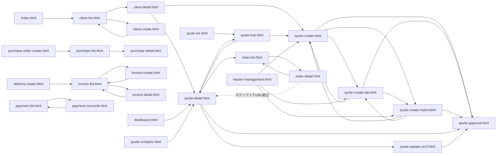

# フロントエンドモック棚卸しレポート（フェーズ1）

**このレポートはフェーズ1（棚卸し）の成果物です。作成時点でリポジトリのコード・ファイルの変更は一切実施していません。**

監査日の目安: 2026-05-02（ワークスペース内ファイルの更新日に基づく事実）。  
推測・解釈は本文で明示します。

---

## オーナー用 決定欄（赤入れ用）

| 論点 | 決定メモ |
|------|----------|
| 見積ハブ vs 一覧エントリ（`quote-list`）の整理方針 | |
| 孤立ページ（ダッシュボード等）の採否・ナビへの載せ方 | |
| 3系統見積作成画面の一本化／ラベル統一 | |
| `QUO-2026-0099` 等ダミー番号の正本（一覧との突合） | |
| `quote-edit` / `purchase-detail` の実装優先度 | |

---

## 1. ファイル一覧

**スコープ**: リポジトリ直下の `index.html`、`pages/*.html`、`css/app.css`、`js/*.js`。  
**補足（事実）**: 画像・フォント等のバイナリアセット（`png` / `jpg` / `svg` / `woff` 等）はワークスペース内の `Glob` では **0件** でした。  
**補足**: `tools/split_pages.py` はページ分割用スクリプト（HTML/CSS/JS 以外）として存在します。

| パス | 種別 | 推定された役割（1行） | 最終更新日 | サイズ感（行数） |
|------|------|------------------------|------------|------------------|
| `index.html` | HTML | ルートから `pages/client-list.html` へ誘導するランディング | 2026-05-03 | 13行・極小 |
| `pages/audit-log.html` | HTML | 監査ログ一覧（検索・テーブル） | 2026-05-02 | 287行・中 |
| `pages/client-create.html` | HTML | クライアント新規登録フォーム | 2026-05-03 | 413行・中 |
| `pages/client-detail.html` | HTML | クライアント詳細・関連見積テーブル | 2026-05-03 | 219行・中 |
| `pages/client-list.html` | HTML | クライアント一覧・詳細への導線 | 2026-05-03 | 168行・中 |
| `pages/dashboard.html` | HTML | 月次サマリー・承認待ち等のダッシュボード | 2026-05-02 | 183行・中 |
| `pages/delivery-create.html` | HTML | 納品書作成フォーム（請求書選択等） | 2026-05-02 | 129行・中小 |
| `pages/document-history.html` | HTML | 帳票出力履歴の検索・一覧 | 2026-05-02 | 88行・小 |
| `pages/integration-settings.html` | HTML | 外部システム連携設定UI | 2026-05-02 | 200行・中 |
| `pages/invoice-create.html` | HTML | 請求書作成（プレビュー・マスタ連想データ） | 2026-05-03 | 944行・大 |
| `pages/invoice-detail.html` | HTML | 請求書詳細（オブジェクト形式のダミーデータ） | 2026-05-03 | 618行・大 |
| `pages/invoice-list.html` | HTML | 請求一覧・詳細への遷移 | 2026-05-03 | 236行・中 |
| `pages/master-management.html` | HTML | 見積条件・単価等のマスタ編集（localStorage / fetch 連携） | 2026-05-04 | 1783行・特大 |
| `pages/order-detail.html` | HTML | 受注詳細（見積書埋め込み・見積詳細への動的リンク） | 2026-05-02 | 67行・小 |
| `pages/order-list.html` | HTML | 受注一覧・受注詳細への導線 | 2026-05-02 | 109行・中小 |
| `pages/payment-list.html` | HTML | 入金管理一覧・消込画面への導線 | 2026-05-02 | 152行・中小 |
| `pages/payment-reconcile.html` | HTML | 入金消込（特定請求番号を前提） | 2026-05-02 | 138行・中小 |
| `pages/purchase-detail.html` | HTML | 発注詳細（**本文プレースホルダのみ**） | 2026-05-02 | 20行・極小 |
| `pages/purchase-list.html` | HTML | VN発注一覧・月次サマリー・詳細への導線 | 2026-05-03 | 255行・中 |
| `pages/purchase-order-create.html` | HTML | 注文書作成フォーム | 2026-05-02 | 111行・中小 |
| `pages/quote-approval.html` | HTML | 見積承認（差分・承認/差戻しUI） | 2026-05-02 | 128行・中小 |
| `pages/quote-compare.html` | HTML | 見積バージョン比較 | 2026-05-02 | 114行・中小 |
| `pages/quote-create-lab.html` | HTML | ラボ見積新規作成（大規模フォーム・プレビュー） | 2026-05-04 | 2769行・特大 |
| `pages/quote-create-maint.html` | HTML | 保守見積新規作成 | 2026-05-04 | 2514行・特大 |
| `pages/quote-create.html` | HTML | 請負見積新規作成 | 2026-05-04 | 3567行・特大 |
| `pages/quote-detail.html` | HTML | 見積詳細（タブ・閲覧モード・URLパラメータ連動） | 2026-05-03 | 3254行・特大 |
| `pages/quote-edit.html` | HTML | 見積編集（**説明文のみ・本体未実装**） | 2026-05-03 | 22行・極小 |
| `pages/quote-hub.html` | HTML | 見積一覧ハブ（フィルタ・一覧・詳細への `data-href`） | 2026-05-04 | 220行・中 |
| `pages/quote-list.html` | HTML | `quote-hub.html` への **即時リダイレクト**用スタブ | 2026-05-04 | 12行・極小 |
| `pages/quote-update-ver3.html` | HTML | 見積書 ver3 更新フロー | 2026-05-04 | 2666行・特大 |
| `css/app.css` | CSS | サイドバー・ヘッダー・レイアウト共通スタイル | 2026-05-03 | 309行・中 |
| `js/layout.js` | JS | サイドバー/ヘッダー挿入、`TITLES` / `NAV` 定義 | 2026-05-04 | 135行・小 |
| `js/quote-lab-condition-defaults.js` | JS | ラボ見積条件文言の localStorage + `fetch` でHTMLから組み込み値取得 | 2026-05-04 | 157行・中小 |
| `js/quote-legal-common.js` | JS | 見積作成画面間で共有する法務系ロジック（推定） | 2026-05-04 | 43行・小 |
| `js/quote-maint-basic-defaults.js` | JS | 保守見積「基本設定」の localStorage + `fetch` | 2026-05-04 | 134行・中小 |
| `js/quote-maint-condition-defaults.js` | JS | 保守見積条件文言の localStorage + `fetch` | 2026-05-04 | 142行・中小 |
| `js/quote-ukeoi-basic-defaults.js` | JS | 請負見積「基本設定」の localStorage + `fetch` | 2026-05-04 | 133行・中小 |
| `js/quote-ukeoi-condition-defaults.js` | JS | 請負見積条件文言の localStorage + `fetch` | 2026-05-04 | 153行・中小 |
| `js/quote-unit-price-config.js` | JS | 単価区分マスタの localStorage 永続化 | 2026-05-02 | 149行・中小 |

---

## 2. ページ遷移グラフ

**前提（事実）**: 以下は `href` / `data-href` / `onclick="location.href='...'"` / インラインスクリプト内の `location.href = '...html'` など、**リポジトリ内に文字列として現れた** HTML 間リンクを集約したものです。`layout.js` のサイドバーは **`quote-list.html` / `invoice-list.html` / `purchase-list.html` / `client-list.html` / `master-management.html`** の5項目のみです（`js/layout.js:39` 付近）。

**赤字注記（孤立）**: 上記グラフに **入射辺がない**（他HTML/当該HTML内スクリプトから `.html` として参照が見つからない）ページは次のとおりです（`grep` による全リポジトリ検索、`dashboard` / `document-history` / `integration-settings` / `audit-log` / `quote-edit` / `quote-compare` / `purchase-order-create` / `delivery-create` のファイル名で確認）。

- `pages/dashboard.html`
- `pages/document-history.html`
- `pages/integration-settings.html`
- `pages/audit-log.html`
- `pages/quote-edit.html`
- `pages/quote-compare.html`
- `pages/purchase-order-create.html`
- `pages/delivery-create.html`

**補足（推測）**: 上記は「モック内リンクの観点での孤立」です。ブックマークや手入力URLでは到達可能です。

---

## 3. ページ分類

**分類基準（監査者定義）**

- **本筋(active)**: サイドナビから到達可能、または主要フロー（見積→承認/受注、クライアント、請求、入金、マスタ）の中核。
- **孤立(orphan)**: §2 のとおり、他ページから `.html` 参照なし。
- **重複(duplicate)**: 同一ドメインの別バリアント（見積3種、`quote-list` と `quote-hub` 等）。
- **未完成(wip)**: 本文が空に近い、プレースホルダ文言、マスタ上の「準備中」ボタン等。
- **判別不能(unknown)**: 目的は読み取れるが上記のどれにも強く当てはまらない場合に限定（本モックではほぼ未使用）。

「アーカイブ候補?」は **自動判断ではなく**、根拠メモのみ（`y` / `n` / `?`）。

| ファイル | 分類 | アーカイブ候補? | 根拠メモ | オーナー決定 |
|----------|------|-----------------|----------|--------------|
| `index.html` | active | n | エントリ | |
| `pages/client-list.html` | active | n | ナビ＋ルート誘導先 | |
| `pages/client-detail.html` | active | n | 一覧からリンク | |
| `pages/client-create.html` | active | n | 一覧からリンク | |
| `pages/quote-list.html` | duplicate | ? | `quote-hub` へのリダイレクト専用（`pages/quote-list.html:5`）。ナビの実URL。残すなら役割は明文化が必要。 | |
| `pages/quote-hub.html` | active | n | 見積業務のハブ | |
| `pages/quote-detail.html` | active | n | ハブ・受注・承認と接続 | |
| `pages/quote-create.html` | active / duplicate | ? | 本筋だが請負/保守/ラボと3分割。整理時はグルーピング単位で判断。 | |
| `pages/quote-create-maint.html` | active / duplicate | ? | 同上 | |
| `pages/quote-create-lab.html` | active / duplicate | ? | 同上 | |
| `pages/quote-update-ver3.html` | active | n | 詳細から遷移 | |
| `pages/quote-approval.html` | active | n | 詳細・更新・各作成から遷移 | |
| `pages/order-list.html` | active | n | 見積詳細から | |
| `pages/order-detail.html` | active | n | 受注一覧から | |
| `pages/invoice-list.html` | active | n | ナビ | |
| `pages/invoice-create.html` | active | n | 一覧から | |
| `pages/invoice-detail.html` | active | n | 一覧のスクリプト遷移 | |
| `pages/payment-list.html` | active | n | ナビ（`layout.js` では `payment-list`） | |
| `pages/payment-reconcile.html` | active | n | 入金一覧から | |
| `pages/purchase-list.html` | active | n | ナビ | |
| `pages/purchase-detail.html` | wip | ? | `page-root` が空（`pages/purchase-detail.html:14`） | |
| `pages/master-management.html` | active / wip | ? | 全体は巨大だが一部ボタンが `disabled` の「準備中」（例: `pages/master-management.html:189`） | |
| `pages/dashboard.html` | orphan | ? | ナビにもリンクもなし。将来のホーム候補。 | |
| `pages/document-history.html` | orphan | ? | 帳票履歴として自然だが導線なし | |
| `pages/integration-settings.html` | orphan | ? | 設定系。導線なし | |
| `pages/audit-log.html` | orphan | ? | コンプライアンス系。導線なし | |
| `pages/quote-edit.html` | wip | ? | 説明1行のみ（`pages/quote-edit.html:15`） | |
| `pages/quote-compare.html` | orphan | ? | 比較UIはあるがどこからも未リンク | |
| `pages/purchase-order-create.html` | orphan | ? | キャンセルで `purchase-list` のみ。一覧からの新規導線なし | |
| `pages/delivery-create.html` | orphan | ? | キャンセルで `invoice-list` のみ。請求詳細からの導線なし（検索では未検出） | |

---

## 4. 用語の揺らぎ一覧

| 概念（推定） | 出現バリエーション | 出現箇所（ファイル:行の例） | 候補となる正規語（提案・複数可） |
|-------------|-------------------|---------------------------|----------------------------------|
| 自社略称（原価ラベル） | 「OTA原価」vs 全体としての「OTJ」ブランド表記 | `pages/quote-approval.html:35`（OTA原価）、`pages/quote-create.html` 等で「OTJ売上」（例: `pages/master-management.html:586`） | 「OTJ原価」への統一、または「VN/OTA別」に列を分けて定義 |
| 見積一覧の呼び方 | ナビラベル「見積一覧」、`TITLES` で `quote-list` と `quote-hub` が同じ日本語 | `js/layout.js:11-12`, `js/layout.js:44` | 「見積ハブ」「見積一覧（レガシーURL）」など役割を分けた名称 |
| 見積の表記ゆれ（ひらがな） | 「見積」vs「見積り」 | `pages/dashboard.html:37`（有効見積**り**件数）、`pages/quote-hub.html:31` 付近（見積番号） | 社内用語集に合わせてどちらかに固定 |
| 取引先呼称 | 「クライアント」（UI）／条項文面の「顧客」 | `pages/quote-hub.html:34` vs `pages/quote-create-lab.html:1234`（顧客情報） | UIは「クライアント」、条文は「顧客」のまま、等の役割分担を明文化 |
| 人物ロール（作成系） | 「作成者」「出力者」「担当PM」「承認者」 | `pages/quote-approval.html:29`（作成者）、`pages/document-history.html:50`（出力者）、`pages/order-list.html:54`（担当PM）、`pages/quote-hub.html:95`（承認者） | 業務上の正式ロール名（申請者/承認者/実行責任者など）にマッピング表 |
| 請求番号体系 | 「請求書番号」「請求番号」「OTJ-INV-…」「INV-…」 | `pages/invoice-create.html:411`、`pages/payment-reconcile.html:24`、`pages/purchase-list.html:142` | 対外INVと内部OTJ-INVの二層があるのか、誤記なのかを定義 |

---

## 5. 論理的な矛盾・曖昧さ

| # | 該当ファイル | 具体内容 | 想定される影響 |
|---|--------------|----------|----------------|
| 1 | `pages/quote-hub.html` vs `pages/order-list.html` | ハブのダミー行は `QUO-2026-0045` 〜 `0039` に収まる一方、受注一覧2行目は `QUO-2026-0099`（`pages/order-list.html:67`）。**0099 はハブ表に未登場**（grep結果ベースの事実）。 | 受注デモと見積一覧デモが同一世界観に見えず、デモ説明時に混乱。 |
| 2 | `pages/quote-hub.html` vs `pages/order-list.html` | ハブ1行目は URL 上 `status=pending`（`pages/quote-hub.html:100`）だが、受注一覧同案件は「進行中」（`pages/order-list.html:58-64`）。**同一見積番号でライフサイクル表現が並立**。 | 「承認待ち＝受注済み」なのかモック不整合なのか判断が必要。 |
| 3 | `pages/quote-hub.html` vs `pages/order-list.html` | 見積ステータスは多段（新規/承認待ち/…/失注/却下等、`pages/quote-hub.html:40-47`）。受注側は「進行中」「完了」のみ（`pages/order-list.html:31-34`）。 | ステータスモデルが画面間で未接続。 |
| 4 | `pages/quote-detail.html` vs `pages/quote-compare.html` | 詳細に「比較」導線は見当たらず（`quote-detail` 内 `compare` grep 0件）、`quote-compare.html` は **どこからもリンクされていない**。 | 比較機能のユーザー到達経路が未定義。 |
| 5 | `pages/invoice-detail.html` 等 vs `pages/delivery-create.html` | 納品書作成は `delivery-create.html` に存在するが、請求詳細からの `href` は検出できず（孤立）。 | 納品業務フローがモック上途切れている可能性。 |
| 6 | `pages/purchase-list.html` vs `pages/purchase-order-create.html` | 注文書作成ページはキャンセルのみ `purchase-list` へ戻る（`pages/purchase-order-create.html:99`）。一覧からのリンクは未検出。 | VN発注フローで「注文書作成」の位置づけが曖昧。 |
| 7 | `js/layout.js` | ヘッダーのドロップダウン「プロフィール」「設定」は `href="#"`（`js/layout.js:112-113`）。 | クリック可能だが遷移先モックなし。 |
| 8 | `pages/client-detail.html` | 見積行クリックは `location.href='quote-detail.html'` のみで **クエリなし**（`pages/client-detail.html:168`）。 | 詳細側のURLパラメータ前提とズレる可能性（詳細側がデフォルト表示にフォールバックするなら許容）。 |

---

## 6. ダミーデータの整合性

**一貫している例（事実）**

- `QUO-2026-0045` + 株式会社テックソリューション + ECサイトリニューアル + 金額レンジは、`pages/quote-hub.html`、`pages/quote-approval.html`、`pages/order-list.html` 1行目、`pages/quote-create*.html` の選択肢等で揃っている。

**不整合・要注意（事実＋推測）**

| 観点 | 内容 | 根拠 |
|------|------|------|
| 見積番号の欠番 | `QUO-2026-0099` が請求・受注モックには出るが、見積ハブ表には無い | `pages/order-list.html:67`、`pages/invoice-create.html:256` 付近 vs `pages/quote-hub.html` 行データ |
| 請求番号と請求書オブジェクト | `invoice-detail.html` のキーは `INV-2026-*`（`pages/invoice-detail.html:386` 付近のオブジェクト）、入金・帳票履歴も同番号帯を使用 | `pages/payment-list.html:98` 等 |
| 発注一覧の OTJ-INV | `purchase-list.html` は `OTJ-INV-2026-*` 表記（`pages/purchase-list.html:142`）。請求一覧は `INV-2026-*`。 | 内部番号と対外番号の二重管理なのか、単なる表記ゆれなのか **人間確認が必要（推測）**。 |

---

## 7. ロール・権限の痕跡

**観測できたロール表現（事実）**

- ヘッダー: ドロップダウン表示名が「管理者」（`js/layout.js:110`）。
- 見積一覧: 列「承認者」（`pages/quote-hub.html:95`）。
- 見積承認: 「承認」「差戻し」ボタン（承認者視点のモック、`pages/quote-approval.html` 全体）。
- 受注一覧: 「担当PM」（`pages/order-list.html:54`）。
- 帳票履歴: 「出力者」（`pages/document-history.html:50`）。

**矛盾・曖昧さ（推測）**

- 「管理者」がサイドバー上の全メニューにアクセスする前提か、承認者・PM と分離される前提かは **HTML からは断定不可**。権限マトリクスは別資料がないと追えません。

---

## 8. アセット・依存

### 8.1 使われていないCSS/JS/画像

- **画像・フォントファイル**: ワークスペース内に該当拡張子のファイルは見つかりませんでした（§1 補足）。
- **CSS `app.css`**: 各 `pages/*.html` が `../css/app.css` を参照（パターンとして一貫）。**未使用の可能性は低い**（事実: 全ページがリンク）。
- **JS**: `quote-legal-common.js` は `quote-create.html` / `quote-create-maint.html` / `quote-create-lab.html` のみが参照（`grep`）。**上記3画面以外では未使用**（事実）。他 `js/*` は `master-management` または対応する見積ページが参照。

### 8.2 外部CDN

- **Bootstrap 5.3.2** CSS/JS: `cdn.jsdelivr.net`（各HTMLで共通パターン）。
- **Bootstrap Icons 1.11.1** CSS: `cdn.jsdelivr.net`。

### 8.3 外部API・ネットワーク呼び出し

- **REST API のようなエンドポイント呼び出しは検出せず**（`grep` 範囲: `js/*.js` の `fetch(` は **相対パス `*.html` を取得**する用途に限定、`js/quote-ukeoi-condition-defaults.js:56-61` 等）。
- **推測**: オフラインで `file://` 開いた場合、`fetch('quote-create.html')` はブラウザにより失敗しうる。`http(s)://` での静的配信が前提の実装パターン。

### 8.4 ライブラリ依存

- **Bootstrap 5**（Vanilla JS 前提の `bootstrap.bundle.min.js`）。**jQuery 依存は見つからず**（`$` / `jQuery` grep 対象外）。

---

## 9. 監査者所見（人間が判断すべき論点）

1. **見積の「正」の一覧画面**: `quote-list.html` をナビ実体に残すか、`quote-hub.html` に統一してURLを切り替えるか。リダイレクトスタブのまま運用する意図の文書化。
2. **3系統の見積作成（請負/保守/ラボ）**: プロダクトとして3画面維持か、タブ切替1画面か。マスタ（`master-management.html`）との対応は既にコメントで説明されているため、**製品方針とコメントの整合**を取るか。
3. **孤立ページの扱い**: ダッシュボード・帳票履歴・監査ログ・連携設定・比較・納品・注文書作成を、ナビに載せるか、別「管理者メニュー」にまとめるか。
4. **ダミー番号の正本**: 特に `QUO-2026-0099` を見積ハブに載せるか、受注/請求側の番号をハブに合わせるか。
5. **用語（OTJ/OTA、クライアント/顧客、見積/見積り）**: 画面ラベルと原価設計用語の辞書を1枚にまとめると整理が速い。
6. **`purchase-detail` / `quote-edit`**: プレースホルダのまま残すか、最小限の読み取り専用詳細にするか。
7. **`fetch` + `localStorage` 前提**: 静的ホスティング方法（`file://` 不可の可能性）を README 等で共有するか（※本フェーズではドキュメント作成の指示なしのため所見のみ）。

---

## 作業ログ（事実）

- **新規作成したファイル**: `mock-audit.md`（本ファイル）のみ。
- **変更したその他のファイル**: なし。
